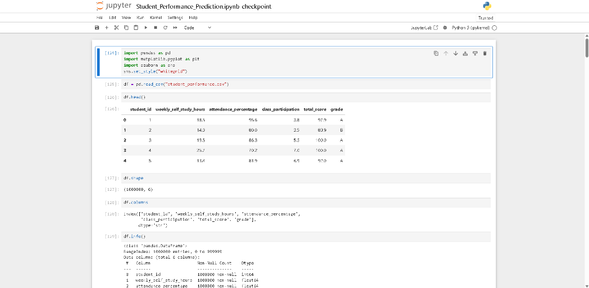

# Student Performance Prediction & Analysis System

> An end-to-end machine learning project for analyzing student performance and predicting student outcomes using supervised learning techniques.



---

## Project Overview

The **Student Performance Prediction & Analysis System** is an end-to-end machine learning solution designed to analyze academic and behavioral data to predict whether a student will **Pass** or **Fail**. Developed as a **Day 1 – AI/ML Intern Ability Assessment Task**, this project evaluates student risk levels using key academic metrics such as self-study duration, class attendance, and participation.

### Key Highlights
- **1,000,000 Student Records**: Processed and analyzed a large-scale dataset of student performance indicators.
- **Exploratory Data Analysis (EDA)**: Investigated distribution, correlations, and performance benchmarks across grade levels.
- **Handling Severe Class Imbalance**: Addressed a 99.38% Pass vs. 0.62% Fail distribution using balanced class weighting (`class_weight='balanced'`).
- **Model Development & Evaluation**: Built and benchmarked **Logistic Regression** and **Random Forest Classifier** models, prioritizing minority-class Recall to detect at-risk students.
- **Model Selection & Interpretation**: Selected Logistic Regression for its exceptional **94.36% Fail Recall** and interpretable feature coefficients.
- **Interactive Prediction Function**: Implemented a standalone prediction pipeline for evaluating individual student profiles.

---

## Problem Statement

In academic environments, early identification of struggling students is critical for timely educational intervention. Traditional evaluation methods often rely on end-of-term results when it is too late to offer remedial support.

The objective of this project is to leverage student behavioral data—specifically **weekly self-study hours**, **attendance percentage**, and **class participation scores**—to:
1. Analyze performance patterns across grade spectrums.
2. Preprocess and clean large-scale academic datasets.
3. Address severe class imbalance inherent in passing/failing distributions.
4. Train and compare supervised classification models.
5. Identify at-risk students (`Fail` target state) with high recall.
6. Provide an intuitive interface for generating real-time predictions for sample student records.

---

## Project Objectives

- **Data Loading & Inspection**: Verify dataset integrity, data types, missing values, and record duplication across 1,000,000 entries.
- **Exploratory Data Analysis**: Conduct statistical analysis and visualize distributions, correlation matrices, and grade-based feature variance.
- **Data Preprocessing**: Map 5-point letter grades (`A`, `B`, `C`, `D`, `F`) into a binary classification target (`pass_fail`).
- **Feature Selection**: Remove identifiers (`student_id`) and target-correlated features (`total_score`, `grade`) to eliminate data leakage.
- **Train-Test Splitting & Scaling**: Execute an 80/20 stratified split and scale numerical features using `StandardScaler`.
- **Model Training**: Train **Logistic Regression** and **Random Forest Classifier** algorithms with cost-sensitive class balancing.
- **Model Evaluation & Comparison**: Assess performance using Accuracy, Precision, Recall, F1 Score (focused on the minority `Fail` class), and Confusion Matrices.
- **Feature Importance Analysis**: Extract and plot logistic coefficients to understand feature impact on student pass probability.
- **Prediction Pipeline**: Build a function (`predict_student`) to deliver instant pass/fail predictions for new student inputs.

---

## Dataset Information

The dataset is stored in `student_performance.csv` and contains **1,000,000 student records** with 6 attributes.

### Dataset Summary

| Parameter | Value |
|---|---|
| **Total Rows** | 1,000,000 |
| **Total Columns** | 6 |
| **Missing Values** | 0 (0.0%) |
| **Duplicate Records** | 0 |
| **Target Variable (Raw)** | `grade` ('A', 'B', 'C', 'D', 'F') |
| **Target Variable (Processed)** | `pass_fail` ('Pass', 'Fail') |

### Feature Descriptions

| Feature Name | Data Type | Range / Values | Description |
|---|---|---|---|
| `student_id` | Integer | `1` - `1,000,000` | Unique student identification number (dropped during modeling). |
| `weekly_self_study_hours` | Float | `0.0` - `40.0` hrs | Average hours spent in self-study per week (Mean: 15.03, Std: 6.90). |
| `attendance_percentage` | Float | `50.0%` - `100.0%` | Percentage of scheduled classes attended (Mean: 84.71%, Std: 9.42%). |
| `class_participation` | Float | `0.0` - `10.0` | Teacher-assessed class participation score (Mean: 5.99, Std: 1.96). |
| `total_score` | Float | `9.4` - `100.0` | Overall composite score (Mean: 84.28, Std: 15.43) (dropped to prevent leakage). |
| `grade` | Categorical | `A`, `B`, `C`, `D`, `F` | Letter grade derived from `total_score` (mapped to `pass_fail`). |

---

## Machine Learning Workflow

The end-to-end pipeline follows a structured, robust machine learning workflow:

```mermaid
flowchart TD
    A[Raw Dataset: student_performance.csv<br/>1,000,000 rows] --> B[Data Inspection & Verification<br/>Check nulls & duplicates]
    B --> C[Exploratory Data Analysis<br/>Histograms, Boxplots, Correlation Heatmap]
    C --> D[Data Preprocessing<br/>Binary mapping: A-D -> Pass, F -> Fail]
    D --> E[Feature Selection<br/>Drop student_id, grade, total_score]
    E --> F[Stratified Train/Test Split<br/>80% Train: 800,000 | 20% Test: 200,000]
    F --> G[Feature Scaling<br/>StandardScaler fit on X_train]
    G --> H[Model Training<br/>Logistic Regression & Random Forest]
    H --> I[Model Evaluation<br/>Accuracy, Precision, Recall, F1 Score & Confusion Matrix]
    I --> J[Model Comparison & Selection<br/>Selected: Logistic Regression for 94.36% Fail Recall]
    J --> K[Feature Coefficient Analysis<br/>Study Hours +4.44, Participation +0.02, Attendance -0.04]
    K --> L[Interactive Prediction Function<br/>predict_student study_hours, attendance, participation]
```

---

## Exploratory Data Analysis (EDA)

Exploratory analysis yielded key insights into student grade distribution and feature relationships:

### 1. Grade Distribution

| Grade | Count | Percentage | Processed Label |
|---|---:|---:|---|
| **A** | 548,644 | 54.86% | `Pass` |
| **B** | 258,174 | 25.82% | `Pass` |
| **C** | 141,980 | 14.20% | `Pass` |
| **D** | 44,998 | 4.50% | `Pass` |
| **F** | 6,204 | 0.62% | `Fail` |

### 2. Score Statistics by Grade

| Grade | Minimum Score | Maximum Score | Mean Total Score |
|---|---:|---:|---:|
| **A** | 85.0 | 100.0 | 96.04 |
| **B** | 70.0 | 85.0 | 77.95 |
| **C** | 55.0 | 70.0 | 63.56 |
| **D** | 40.0 | 55.0 | 49.38 |
| **F** | 9.4 | 40.0 | 35.47 |

### 3. Visualizations Executed in Notebook
- **Grade Count Plot**: Bar visualization confirming the distribution of student letter grades (`sns.countplot`).
- **Feature Distribution Histograms**: Grid histograms displaying the spread of study hours, attendance, participation, and total score (`hist()`).
- **Feature Box Plots by Grade**: Multi-panel boxplots illustrating feature medians and interquartile ranges across grades (`sns.boxplot`).
- **Correlation Heatmap**: Visualizing relationships between numerical predictor features (`sns.heatmap`).

---

## Data Preprocessing

1. **Target Engineering (`pass_fail`)**:
   - Grades `A`, `B`, `C`, and `D` were mapped to `"Pass"` (993,796 records | 99.38%).
   - Grade `F` was mapped to `"Fail"` (6,204 records | 0.62%).
2. **Feature Removal**:
   - `student_id`: Dropped as non-predictive metadata.
   - `total_score` & `grade`: Dropped to prevent direct data leakage.
   - Final Predictor Features ($X$): `weekly_self_study_hours`, `attendance_percentage`, `class_participation`.
3. **Stratified Train-Test Split**:
   - Split Ratio: 80% Training ($N = 800,000$), 20% Testing ($N = 200,000$).
   - `random_state=42`, `stratify=y` to preserve exact class proportions in both sets.
4. **Feature Standardization**:
   - Fitted `StandardScaler` on `X_train` and transformed `X_test` to ensure zero mean and unit variance for linear classification.

---

## Machine Learning Models

Two supervised classification models were implemented to handle the binary task under class imbalance:

| Model | Type | Configuration / Parameters | Purpose |
|---|---|---|---|
| **Logistic Regression** | Linear Classifier | `class_weight='balanced'`, `random_state=42`, `max_iter=1000` | Baseline linear model optimizing decision boundaries for imbalanced classes using scaled features. |
| **Random Forest Classifier** | Ensemble Trees | `n_estimators=100`, `class_weight='balanced'`, `random_state=42`, `n_jobs=-1` | Non-linear tree ensemble capturing complex decision boundaries on raw features. |

---

## Model Evaluation

Evaluation metrics were computed on the 200,000 test set instances. Because detecting failing students (`"Fail"`) is the primary objective, evaluation focuses specifically on minority-class **Recall** and **Precision**.

### Test Set Performance Results

| Model | Accuracy | Precision (Fail) | Recall (Fail) | F1 Score (Fail) |
|---|---:|---:|---:|---:|
| **Logistic Regression** | 91.02% (0.910225) | 6.15% (0.061450) | **94.36% (0.943594)** | 11.54% (0.115387) |
| **Random Forest** | **98.79% (0.987855)** | **12.45% (0.124526)** | 15.87% (0.158743) | **13.96% (0.139568)** |

---

## Model Comparison & Selection

```text
Logistic Regression vs Random Forest Evaluation:

- Overall Accuracy:    Random Forest (98.79%) > Logistic Regression (91.02%)
- Fail Class Recall:   Logistic Regression (94.36%) >> Random Forest (15.87%)
- Interpretability:    Logistic Regression (Direct Coefficients) > Random Forest (Black-box ensemble)
```

### Final Model Selection: Logistic Regression

In academic intervention systems, **false negatives (failing students misclassified as passing) are vastly more costly than false positives**. 
- **Logistic Regression** achieved a **94.36% Recall** for the `Fail` class, successfully identifying 1,171 out of 1,241 failing test students.
- **Random Forest** suffered from conservative tree splits, capturing only 15.87% of failing students despite high accuracy.

### Feature Coefficients (Logistic Regression)

| Feature | Coefficient | Impact Direction |
|---|---:|---|
| `weekly_self_study_hours` | **+4.4440** | Strongest predictor of student success. Higher hours strongly decrease fail probability. |
| `class_participation` | **+0.0197** | Positive association with passing probability. |
| `attendance_percentage` | **-0.0377** | Minor negative weight in scaled space. |

---

## Sample Student Predictions

The model features an interactive function for making real-time predictions:

```python
def predict_student(study_hours, attendance, participation):
    new_student = pd.DataFrame({
        "weekly_self_study_hours": [study_hours],
        "attendance_percentage": [attendance],
        "class_participation": [participation]
    })

    new_student_scaled = scaler.transform(new_student)
    prediction = selected_model.predict(new_student_scaled)

    return prediction[0]
```

### Example Test Scenarios

| Study Hours | Attendance (%) | Participation (0-10) | Model Prediction | Notes |
|---:|---:|---:|:---:|---|
| **20.0** | **90.0%** | **8.0** | `Pass` | High study hours & attendance |
| **1.5** | **87.0%** | **2.0** | `Fail` | Low study hours & participation |
| **5.0** | **70.0%** | **3.0** | `Fail` | Low study hours |
| **4.0** | **95.0%** | **7.0** | `Fail` | High attendance, insufficient study hours |
| **30.0** | **55.0%** | **10.0** | `Pass` | Excellent self-study compensating attendance |
| **10.0** | **5.0%** | **2.0** | `Pass` | Moderate study hours |

---

## Results Summary

1. **Key Driver of Success**: Weekly self-study duration (`weekly_self_study_hours`) is overwhelmingly the most influential factor determining whether a student passes or fails.
2. **Handling Class Imbalance**: Incorporating `class_weight='balanced'` was critical for preventing models from predicting "Pass" for all students.
3. **High Recall Performance**: Logistic Regression successfully flagged **94.36% of failing students** in the test set.

---

## Technologies Used

| Technology | Category | Purpose |
|---|---|---|
| **Python** | Language | Core programming language |
| **Pandas** | Data Processing | Data manipulation, aggregation, and structure analysis |
| **NumPy** | Computation | Numerical computation and array management |
| **Matplotlib** | Visualization | Base plotting and visualization generation |
| **Seaborn** | Visualization | Statistical data visualizations and heatmaps |
| **Scikit-learn** | Machine Learning | Preprocessing, model training, scaling, and evaluation metrics |
| **Jupyter Notebook** | Environment | Interactive development and documentation environment |

---

## Project Structure

```text
Dev-Tech-IT-Solutions/
│
├── assets/
│   └── notebook_preview.png                   # Jupyter Notebook preview screenshot
├── Student_Performance_Prediction.ipynb.ipynb  # Primary notebook with complete EDA & ML pipeline
├── student_performance.csv                    # Dataset containing 1,000,000 student records
├── README.md                                  # Professional project documentation & report
└── LICENSE                                    # MIT License
```

---

## How to Run

### 1. Clone Repository

```bash
git clone https://github.com/NihalMishra3009/Dev-Tech-IT-Solutions.git
cd Dev-Tech-IT-Solutions
```

### 2. Install Required Dependencies

Ensure Python 3.8+ is installed, then install the required libraries:

```bash
pip install pandas numpy matplotlib seaborn scikit-learn jupyter
```

### 3. Launch Notebook

```bash
jupyter notebook
```

Open `Student_Performance_Prediction.ipynb.ipynb` and execute all cells sequentially.

---

## Visual Results

All exploratory graphs, correlation heatmaps, confusion matrices, and feature coefficient bar charts are rendered directly within `Student_Performance_Prediction.ipynb.ipynb`.

---

## Explanation Video

A detailed explanation and walkthrough of the project is available here:

[Watch the Project Explanation Video](https://drive.google.com/drive/folders/1GPu48KHTX4FaXyXCW4yi90A-O6xYhUZo)

---

## GitHub Repository

[View the complete project on GitHub](https://github.com/NihalMishra3009/Dev-Tech-IT-Solutions)

---

## Key Takeaways

- Demonstrated end-to-end Machine Learning pipeline development on a 1-million-record dataset.
- Applied cost-sensitive learning to address severe 99:1 class imbalance.
- Prioritized domain-specific metrics (Recall over Accuracy) to deliver actionable academic risk detection.
- Built an interpretable model with clear coefficient explanations.

---

## Limitations

- **Feature Constraints**: Predictors are limited to 3 metrics (`weekly_self_study_hours`, `attendance_percentage`, `class_participation`).
- **Low Precision on Fail Class**: Due to balanced class weights on a 0.62% minority class, Logistic Regression generates false positives, yielding a ~6.15% precision for the fail label.

---

## Future Improvements

- **Probability Threshold Tuning**: Adjust classification decision thresholds to optimize the Precision-Recall trade-off.
- **Advanced Resampling**: Implement SMOTE or Random UnderSampling to improve minority class precision.
- **Feature Expansion**: Incorporate additional predictors like assignment grades, mid-term scores, and LMS activity logs.
- **Web Deployment**: Package the model into an interactive Web UI using Streamlit or FastAPI.

---

## Author

**Nihal Mishra**  
*AI/ML Intern*  
[GitHub Profile](https://github.com/NihalMishra3009)

---

## License

This project is licensed under the [MIT License](LICENSE).